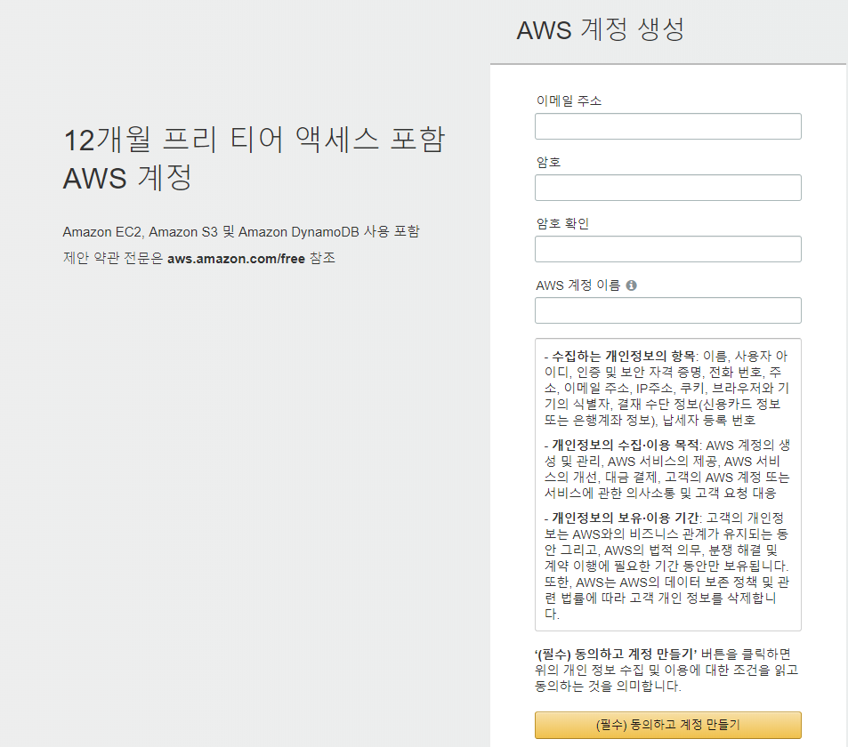
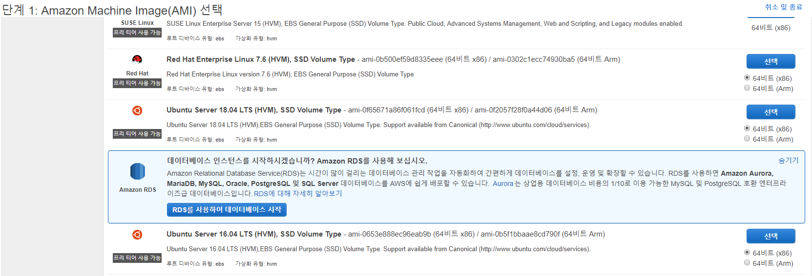
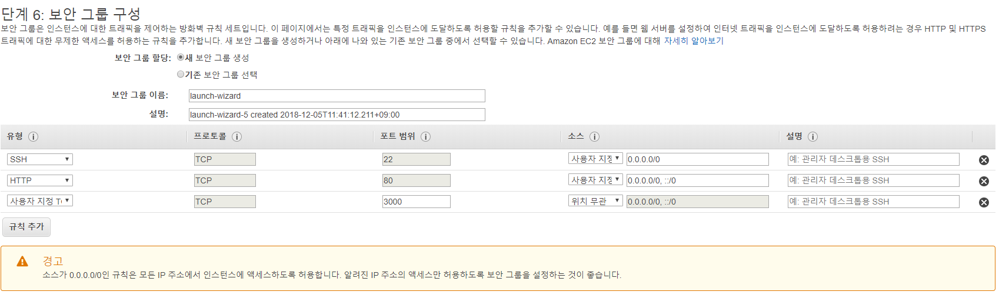
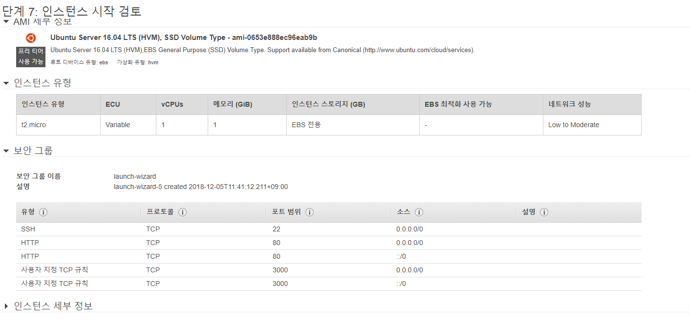
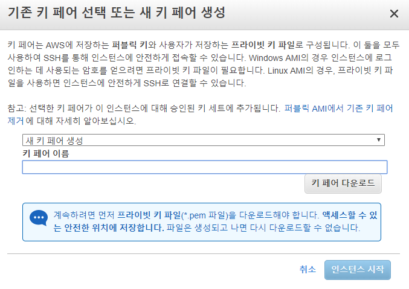
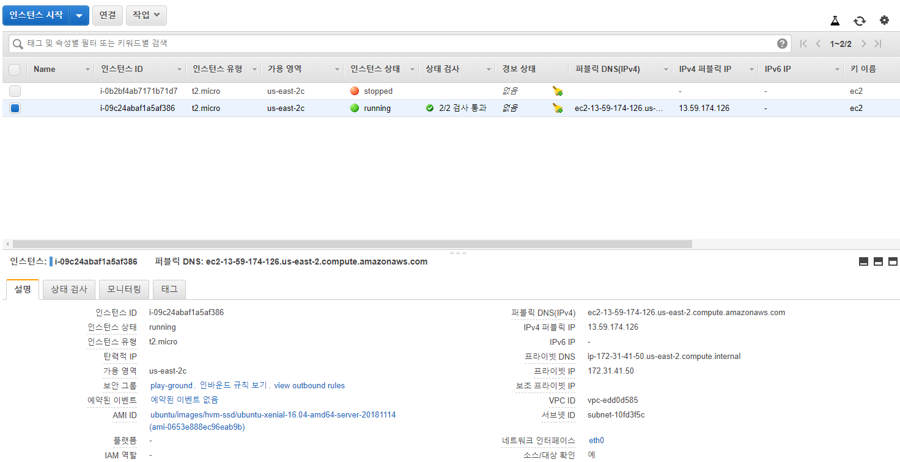
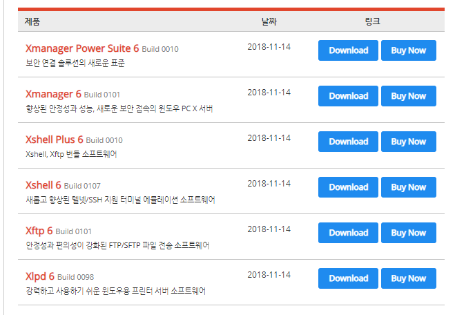
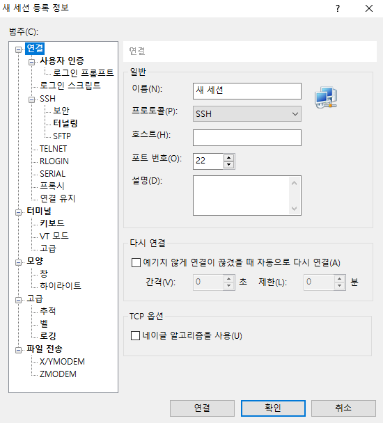
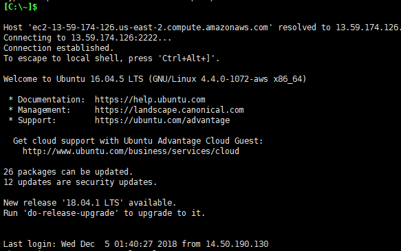

EC2 guide 
=========
## 1. 먼저 AWS 계정을 생성한다.
https://console.aws.amazon.com/console/home  
  

## 2. EC2 인스턴스를 생성한다.  
###생성단계 
* 단계 1: AMI(Amazon Machine Image) 선택  
프리티어 Ubuntu Server 
  

* 단계 2: 인스턴스 유형 선택  
그룹 General Purpose  
유형 t2.micro  

    ~
* 단계 6: 보안 그룹 구성  
보안 그룹 할당에서 새로운 보안그룹을 만들거나 기존에 만든 보안그룹을 사용할 수 있다.  

유형 | 프로토콜 | 포트범위
---- | -------- | --------
SSH | TCP | 22
HTTP | TCP | 80
사용자지정 TCP | TCP | 사용할 포트  
  

* 단계 7: 인스턴스 시작 검토  
인스턴스의 전체적인 설정을 확인할 수 있다.
  

* 키 페어 설정  
인스턴스에 <code>ssh</code> 연결을 하기 위해 비밀 키 페어를 설정해야 한다.  
키 페어도 보안그룹과 마찬가지로 기존에 생성한 키를 선택하거나 새롭게 키를 생성할 수 있다.  
키 생성시 <code>키 이름.pem</code> 의 키가 다운로드 된다.  
나중에 인스턴스에 연결시 사용되므로 반드시 안전하게 보관해야 한다.  
  
  
## 3. 인스턴스 상태 확인하기  
인스턴스 목록에서 생성한 인스턴스의 상태가 <code>running</code> 인지 확인한다.  
stopped 상태라면 <code>인스턴스 상태 - 시작</code>로 인스턴스를 시작한다.  
인스턴스의 설명에서 인스턴스의 퍼블릭 DNS 와 퍼블릭 IP를 확인할 수 있다.  
  

## 4. 인스턴스에 연결하기  
인스턴스에 접속할 때는 SSH 방식으로 접속한다.  
<pre>SSH란?
Secure Sell의 약자로 원격지에 있는 컴퓨터를 안전하게 제어하기 위한 프로토콜 또는 이 프로토콜을 사용하는 프로그램들을 의미한다. SSH 클라이언트와 SSH 서버의 관계로 상호작용하면서 SSH 서버가 설치된 운영체제를 제어한다.
클라이언트와 서버 사이에는 강력한 암호화 방법을 통해서 연결되어 있기 때문에 데이터를 중간에서 가로채도 해석 할 수 없는 암호화된 문자만이 노출된다.
</pre>
  
맥이나 리눅스는 SSH 연결이 내장되어 있지만 윈도우는 별도의 프로그램을 설치해야 한다.  
윈도우에서 SSH 연결을 위한 프로그램인 X Shell 을 다운로드한다.  
http://www.netsarang.co.kr/download/main.html  
  

### Xshell 작업
xshell 을 실행한 후 <code>파일 - 새로 만들기 - 새 세션 정보</code>로 들어간다.  
세션의 이름은 마음대로 설정하고 호스트는 EC2 instance의 퍼블릭 DNS나 퍼블릭 IP를 넣어준다.  
그 후 사용자 인증에서 방법을 <code>Public Key</code>로 설정하고  
사용자 키를 <code>찾아보기..</code>에서 키 페어 설정 때 사용한 <code>키 이름.pem</code>를 등록한다.
  

마지막으로 세션 창을 띄운후 접속 정보를 더블클릭 하면 SSH로 연결된다.  
이 때 <code>알 수 없는 호스트 키</code>라는 창이 나타나면 <code>수락 및 저장</code>을 클릭한다.  

다음은 연결이 성공한 화면이다.  
  