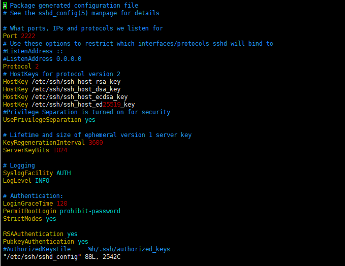

AWS SSH PORT CHANGE
===================
학교에서 개발을 진행중인 것이 아니라면 굳이 이 글을 보지 않아도 된다.  
하지만 만약 22번 포트를 막은 학교에서 개발한다면 이 글을 통해 해답을 얻길 바란다.  

내가 현재 재학중인 학교에서는 22번 포트를 막아두었다.  
보안 상의 문제인지 게임을 막을려는 지는 모르겠지만 어쨋든 22번 포트를 막아두어 에그가 없는 나로서는 AWS 인스턴스에 접속하려고
할 때마다 VPN을 켜야하는 불편함이 있었다.   
게다가 VPN을 키면 원격 접속이 현저히 느려져 작업이 힘들었다.  
그래서 방법을 찾던 중 스택오버플로우에서 AWS ssh 포트를 바꾸는 법을 알게 되었다.  
방법은 다음과 같다.

1. VPN 클라이언트를 키고 ssh 연결을 통해 인스턴스에 접속한다.
2. sudo vim /etc/ssh/sshd_config 명령어를 입력한다.
3. 문서의 Port 22 를 custom(예 2222)로 설정한다.
 
4. sudo service ssh restart 명령어를 입력한다.
5. AWS EC2 인스턴스의 보안규칙 추가한다. 사용자 지정 TCP | 2222
 

이제 설정한 2222 포트로 인스턴스에 접속할 수 있다.
마지막으로 최신 ubuntu 에서는 적용되지 않을 수 있으니 14LTS 버전으로 인스턴스를
만들기를 권유한다.